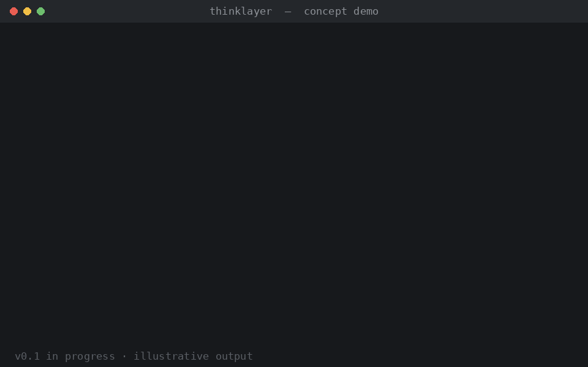

# ThinkLayer

**만들기 전에, 먼저 구조를 봅니다.** AI가 만들기 전의 사고 레이어.

> 생각의 구조를 보여주고, 놓친 부분을 찾고, 다음 길을 안내합니다.

[English](README.en.md)



*콘셉트 데모입니다. v0.1 개발 중이며 출력은 예시입니다.*

---

## 왜 필요한가

AI 코딩 에이전트 덕분에 만드는 속도는 빨라졌지만, **무엇을** 만들지 정하는 속도는 그대로입니다. 아이디어가 바로 코드로 가고, 기능이 쌓이고, 재작업이 시작됩니다.

스펙 주도 개발 도구는 무엇을 만들지 정한 뒤에 도움이 됩니다. ThinkLayer는 그보다 한 단계 앞에서 묻습니다. **이걸 만들어야 하는가, 만든다면 가장 작은 버전은 무엇인가?**

```
아이디어 → ThinkLayer (MAP · GAP · PATH) → PRD / 스펙 → 코딩 에이전트 또는 스펙 도구
```

## 동작 방식

| 단계 | 결과 |
| --- | --- |
| **인터뷰** | 빠진 정보 기준으로 한 번에 한 질문. 짧게 끝나도록 설계 |
| **MAP** | 기능, 데이터, 의존성, 가정, 리스크를 그래프로 표시 |
| **GAP** | 최대 3개. 모두 사용자가 한 말과 연결됨. 일반론 없음 |
| **PATH** | 다음 행동 하나, 그 이유, 미뤄도 되는 것 |

요청하면 `prd.md`와 `agent-instructions.md`를 내보냅니다.

## 원칙

- **결과보다 구조 먼저.** 문제가 명확해지기 전에 답하지 않습니다.
- **모르는 것은 모른다고.** 추측으로 채우지 않고 Unknown·Assumption으로 표시합니다.
- **다음 행동은 하나.** 조언 스무 개가 아니라 지금 할 한 가지.
- **사람이 확정.** 사용자가 확정한 내용은 모델이 덮어쓰지 않습니다.
- **이미 쓰는 AI 그대로.** 모델을 내장하지 않습니다. [인증](#인증) 참고.

## 빠른 시작 (v0.1)

v0.1은 **에이전트 스킬** 형태입니다. 사용 중인 코딩 에이전트가 자기 세션 안에서 실행하는 지침 묶음입니다.

1. 이 레포를 클론합니다.
2. `skills/thinklayer/` 폴더를 사용하는 에이전트의 스킬 폴더에 복사합니다(위치는 각 도구 문서 참고). 스킬을 지원하지 않는 도구라면 `skills/thinklayer/SKILL.md` 내용을 지침으로 붙여 넣습니다.
3. 세션을 열고 "○○를 만들고 싶어"라고 말합니다.

상태는 프로젝트의 `.thinklayer/state.json`에 저장되어 중단 후 이어갈 수 있습니다.

## 레포 구조

```
skills/thinklayer/       핵심 스킬 (인터뷰 → MAP → GAP → PATH)
packs/vibe-coding/       Slot, 질문 힌트, Gap 규칙, Export 형식
schemas/                 Project State JSON Schema
examples/workout-tracker 예시 상태, 맵, PRD
docs/                    데모와 설계 문서
```

## Pack

핵심 흐름은 같고, **Pack**이 목적별 Slot·질문·출력을 정의합니다. v0.1은 Vibe Coding Pack을 제공합니다. Idea, Startup, Project, Decision Pack을 계획 중이며, 장기적으로 Community Pack을 지향합니다.

## 인증

ThinkLayer는 AI 계정의 비밀번호, 인증 정보, 세션 토큰을 요청하거나 읽거나 저장하거나 전달하지 않습니다. 사용자가 직접 로그인한 도구 안에서 실행되거나, 사용자가 설정한 API 키·로컬 모델을 사용합니다. 구독 계정의 사용 범위는 각 제공자의 약관이 정하므로, 연결 전에 확인하세요.

## 진행 상황

| 단계 | 목표 |
| --- | --- |
| 0. Concept | Schema와 Vibe Coding Pack 문서화 ← **현재** |
| 1. Prototype | 아이디어 하나를 끝까지 처리 |
| 2. MVP | 로컬 상태 저장, Export, 사용자 테스트 10~20명 |
| 3. Validation | Gap 유용성과 범위 변화 측정 |
| 4. Release | Pack 작성 가이드, 외부 Pack |

## 기여

초기 단계입니다. 실제로 시도한 아이디어, 쓸모없었던 Gap, 틀렸던 다음 행동을 이슈로 남겨주시는 것이 지금 가장 큰 도움입니다.

## 라이선스

첫 릴리스 전에 결정합니다 (MIT 또는 Apache-2.0).
