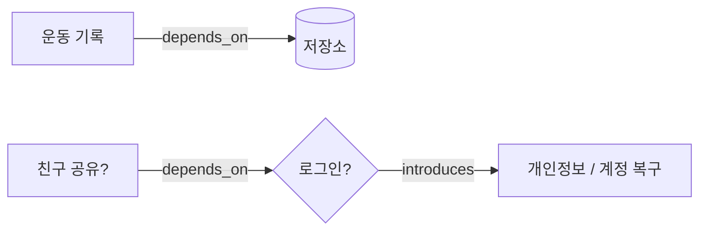

# MAP — workout-tracker

```mermaid
graph LR
  log[운동 기록] -- depends_on --> storage[(저장소)]
  share[친구 공유?] -- depends_on --> login{로그인?}
  login -- introduces --> pii[개인정보 / 계정 복구]
```

`?`로 끝나는 노드는 아직 결정되지 않은 항목입니다.
