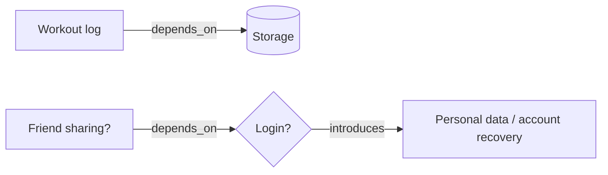

# MAP — workout-tracker

```mermaid
graph LR
  log[Workout log] -- depends_on --> storage[(Storage)]
  share[Friend sharing?] -- depends_on --> login{Login?}
  login -- introduces --> pii[Personal data / account recovery]
```

Nodes ending in `?` are not decided yet.
